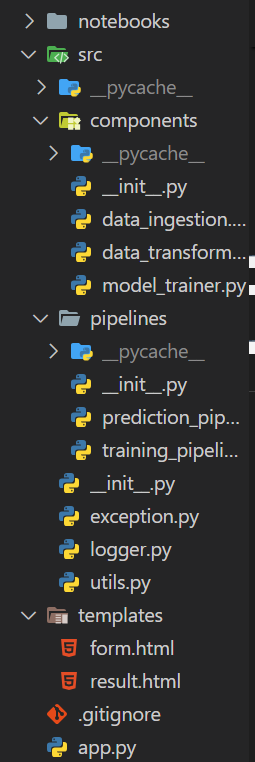
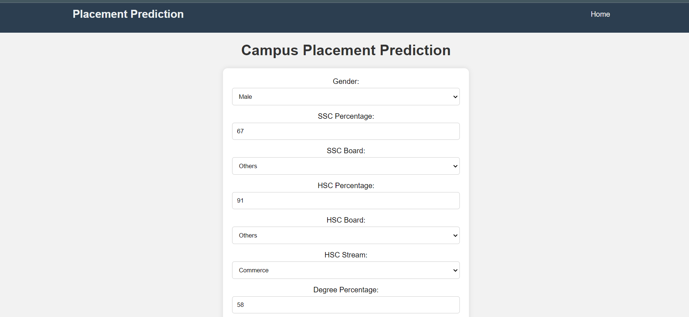
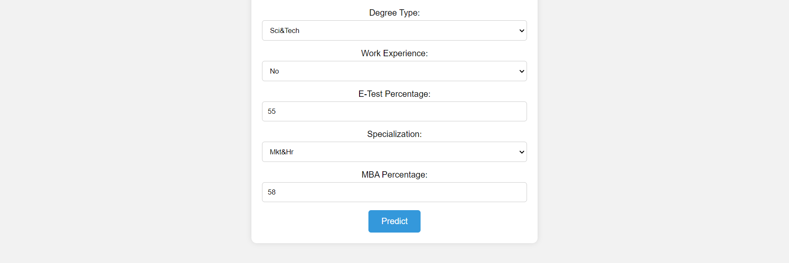

# Campus Placement Prediction Web App

## Overview

This Flask web application leverages machine learning models to predict campus placements based on user-provided input. It provides an intuitive and user-friendly interface for users to input relevant features, such as academic performance, gender, work experience, and more. The application then processes these inputs through a trained machine learning model to generate predictions regarding the likelihood of placement.

## Features

- Predict campus placements using a machine learning model.
- User-friendly interface for inputting details.
- Responsive design for a seamless user experience.

## Getting Started

### Prerequisites

- Python 3.x

### Installation

1. **Clone the repository:**

   git clone https://github.com/ronakbediya310/Campus-Placement-Project.git

2. **Change into the project directory:**
       cd campus-placement-prediction

3. **install dependencies**
  pip install -r rquirements.txr

4. **Run flask app:**
  python  app.py

5. **Open your browser and navigate to http://localhost:5000.**

**Usage:**
Enter the required details in the prediction form.
Click the "Predict" button.
View the prediction result.

***Training Pipeline:***
Explain how to train machine learning models using the provided training pipeline.

***Prediction Pipeline:***
Detail how to make predictions using the prediction pipeline.

***Exception Handling***
Describe the custom exception handling implemented in the project.

***Logging:***
Explain how logging is implemented in the project and where log files can be found.

## Folder Structure:

## Implementation:

**result page**

## Author:Ronak Bediya
